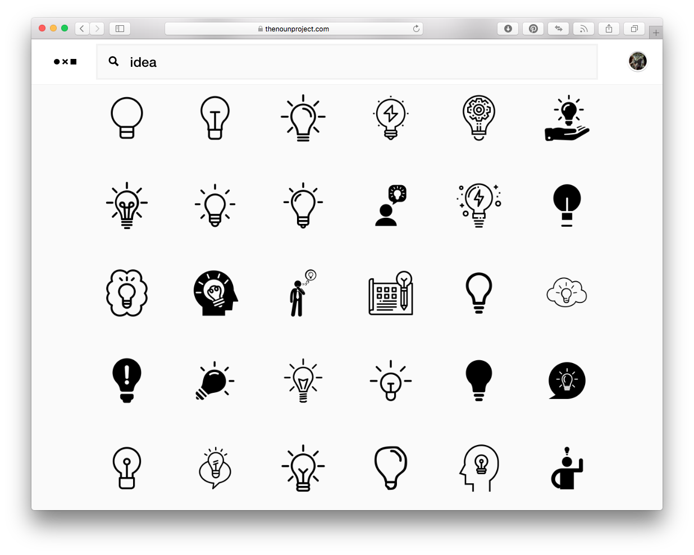
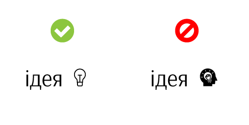

## Загальні ідеї
Використовувати максимально прості способи донесення інформації.

**Наприклад:**
> Нам необхідно підібрати іконки. Нехай то буде іконка «ідеї».
> Йдемо на [Noun Project](https://thenounproject.com)

З усього різноманіття — вона має бути:
> a. найнепригляднішою
> b. чітко асоціювалася саме з предметом пошуку
> c. не була перевантажена уточненнями.
> d. мала таке ж накреслення, що і текст (regular, **bold**)

<mark>**Важливо!**</mark> Іконки мають бути _≈ того самого розміру,_ що й текст. **Тобто**, якщо в нас текст в прикладі 42 pt, то іконки, відповідно, — 36 px. Що майже дорівнює висоті великої літери.